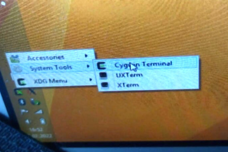
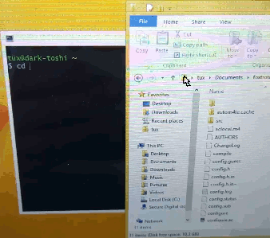
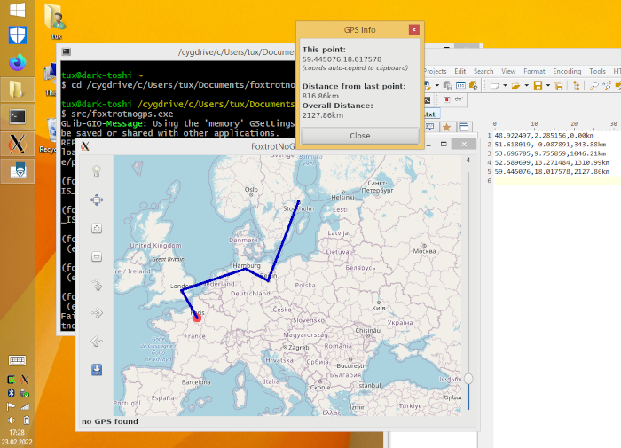

# Win32 cygwin Version (Win8.1 bing)

**GNU = Gnu is NOT Unix** that means, the lovely **foxtrotgps** should run
in M$ Windows, too! Ok, I give it a try!

## (Anti-)Features of my version

- call it FoxtrotNoGPS (gpsd Code is a dummy, because I got trouble with that)
- minimal file setup = maximal **do it yourself**
- original Linux stuff working in Windows with cygwin 32bit (deprecated)
- You need all building and compiling stuff from cygwin
- finaly you have to start `foxtrotnogps.exe` in a X-Server terminal from cygwin
- some glib code is still deprecared in foxtrotgps (lost of warnings during compilation)
- all foxtrotgps icons are missing (not a real problem)
- minimal: just english language (no `po/` files)
- may learn something about `automake` and `autoconf` (it creates Makefiles
  and config and install scripts)

## Your Roadmap to build, a sketch

- get my foxtrotgps files from this repository (win32_cygwin branch)
- get cygwin (32bit) setup, maybe the 64Bit setup is possible, too
- Install this via cygwin:
  - xinit
  - xorg-server
  - gcc
  - make
  - automake
  - autoconf
  - pkg-config
  - intltool
  - imagemagick
  - libxml2, libxml2-dev
  - gconf2, libgconf2-dev, libgtk2.0-dev, libglade2-dev
  - libcurl4-devel, libexif-dev, libsqlite3-dev

This install list based on my memory/brain and may something is missing.
During `./configure` or compiling you got error or a brake and you will
see, what is missing! You can take a look (2022, Februar) on https://www.foxtrotgps.org/build.html
with a similar list. In my version you do **not need** `help2man` and `libgps`.

After installing (ca. 240MB download, 1.5 GB cygwin folder) run the Cygwin
Xserver and use the small icon (next to the clock) to
run a Cygwin-Terminal. Do not use the Cygwin-Terminal Icon from the
Desktop, because that one does not know anything aboaut the X-Server
and its shared display!

A easy way to change directory (cd) on windows and Linux xwindow terminals
is: type `cd` (cd and a aditional space!) and drag and drop the folder-icon of the
filemanager/explorer to the terminal. Do it, now, to change to the directory, where
my foxtrotgps files are stored.

If you type `ls` you see e.g. a `src/` (with `c code` in it and a `Makefile.am`) and
some other important files (especially `configure.ac` and `Makefile.am`).

Now we generate Makefiles, some other default scripts and a `configure` script:

~~~
autoreconf --install
~~~

This will take a while. Make some coffee, now! If everything went fine, these files
will be generated: `configure` and `src/Makefile` and a lot of other files, e.g.
a `Makefile` that just call the Makefile in `src/`.

For a Makefile fine tuning run this:

~~~
./configure
~~~

If it fails, then maybe you install the wrong `gcc` or a lib is missing. If not, then
run `make`:

~~~
make
~~~

Because of foxtrotgps code is a bit out of sync with the actual glib or gtk+ version,
you will get some warnings but finally a `foxtrotnogps.exe` in the `src/` folder.

Finally you have to place 2 files and build a folder for glade and glib:

~~~
mkdir /usr/local/share/foxtrotnogps/
cp foxtrotnogps.glade /usr/local/share/foxtrotnogps/foxtrotnogps.glade
cp org.foxtrotgps.gschema.xml /usr/share/glib-2.0/schemas/
~~~

Say to glib, that there is a new app scheme:

~~~
glib-compile-schemas.exe /usr/share/glib-2.0/schemas/
~~~

Now you can run/execute `src/foxtrotnogps.exe`. It will build a `/home/xxxx/Maps/OSM/`
folder (xxxx = your username) to store OSM tiles. The "normal" path is `C:\cygwin\home\...`
if you want to copy these tiles from a Linux OSM folder to the cygwin system.

## Tested on Win8.1 32bit ok, but does it work on Linux?

Yes. You need the same automake,gcc,autoconf,... tools and development libs and
your Makefiles and configure should be generated for Linux in the same way.
Cause cygwin has a similar directory structure and commands, everything
will be the same (but without .exe).

## Do I need the stupid empty files?

Yes. Maybe with `configure.ac` you can tell autoconf not use or generated them, but I did
not check this. Feel free to google that and get more infos about automake and autoconf!
The original `po/` folder with glib (or gtk+?) text replacements are the 2nd step to
be googled. Maybe in the future I will use all these original foxtrotgps build, generate
and install stuff by default. But for now: this minimal config is good to learn.

## Why org.foxtrotgps.gschema.xml ?

I try `org.foxtrotNOgps.gschema.xml` with NO in file name and content (beginning of xml-file),
but the executeable wants it without NO. Maybe somewhere in the code or config
exists a reference to `org.foxtrotgps` and I did not replace it. I am sorry.

# This is NOT original FoxtrotGPS!

FoxtrotGPS is an easy-to-use graphical tool that can be used
to track the position of a GPS receiver on a map in relation to
user-defined points of interest (POIs), a destination and waypoints,
and tracks loaded from files or internet routing-services.

This code is a modified version of "1.2.2, revno 318, Wed 2019-07-10 02:40:54 -0400".
The original authors are:

    Joshua Judson Rosen <rozzin@geekspace.com>
    Paul Wise <pabs3@bonedaddy.net>
    
    Thanks to the original author of tangoGPS, from which FoxtrotGPS is descended:
    Marcus Bauer <marcus.bauer@gmail.com>
    
See https://www.foxtrotgps.org/ for more detail! If you want to contribute,
use their unknown version control system "Bazaar".

## Why did I modify the original foxtrotgps?

There are no good tools for drawing and displaying routes WITHOUT 
gps-log (including distance measurement). Various websites require 
an upload or fail to display.

FoxtrotGPS has a good function to load and display tracks,
but **I missed the possibility to create tracks manually**. For this reason
I have extended the function for **distance measurement**, where each measuring
point (incl. distance) is **added (and not replaced) in the clipboard**.

The **content of the clipboard** can then easily be **saved with a text editor** and 
later be **loaded and displayed as a track in FoxtrotNoGPS**. Why other programs 
and websites can't do this and only create tracks with a GPS mouse is a 
mystery to me since many years.

# My Comments to the mailing list of foxtrotgps

## 1. june 2020, 16:47

Hello, everyone,

I use foxtrotgps to measure the tracks I have driven - without gps data. Although 
foxtrotgps has this function, but there is no possibility to save it. I would also 
like to be able to load these tracks with a distance measurement. For this I have 
implemented the following ideas in the code:

- with the distance measurement the coordinates are attached to the content of 
  the clipboard instead of being exchanged
- these coordinates are not appended to the clipboard with "lat - lon", but 
  with "lat,lon,distance distunit".
- when loading tracks, the distance per coordinate is calculated and (additively) 
  output in the console with g_printf().

These small adjustments make it possible for me to measure tracks with foxtrotgps
by hand and save it as track via clipboard in a text file. Furthermore I can read 
these files afterwards with foxtrotgps (and other lists with coordinates) and 
have the track measured (distance).

Since I'm not sure if this changed behaviour of foxtrotgps is also desired by 
other users, I don't know if (and how) I should transmit these changes with 
Bazaar.

So at this point I wanted to ask how I should proceed and whether there is any 
interest at these changes.

## 1. june 2020, 22:01

Hi everyone,

These are my first attempts with bazaar and launchpad, but this way you can 
see how I improvised the described procedure of creating track files by
hand and a distance measurement:

https://bazaar.launchpad.net/~deadlockz/+junk/jochen/revision/325

You are welcome to adopt the change if you also think it makes sense for other users.

kindly regards,
Jochen

